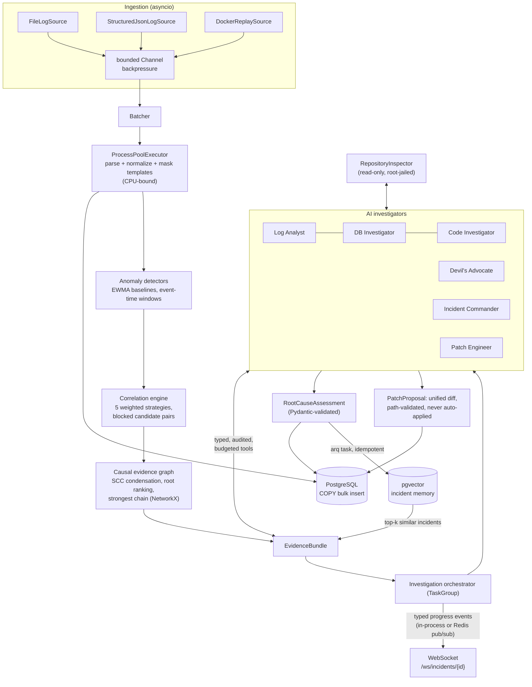

# Aegis AI — Autonomous Incident Investigator

[](https://github.com/domcolelak/aegis-ai/actions/workflows/ci.yml)
[](https://www.python.org/)
[](LICENSE)

Aegis AI is an autonomous incident investigation engine written in Python. It ingests large
volumes of distributed system logs, normalizes and correlates events, constructs a weighted
causal evidence graph, and orchestrates specialized AI investigators that determine the
probable root cause — validated, audited, and streamed live over WebSocket.

<p align="center">
  
</p>

A real recording (`asciinema`, [docs/demo.cast](docs/demo.cast)) of
`uv run python scripts/demo.py` — the whole system, offline, with no API key and no
database. Without the presentation `--pace` it finishes in about a second.

## Architecture



The design principle throughout: **deterministic Python reduces the problem space; AI
interprets what remains.** Agents never see raw logs — they receive an `EvidenceBundle`
(anomaly clusters, ranked root candidates, strongest causal chains, similar historical
incidents) and drill deeper only through typed, audited, budgeted tools.

## Quickstart

```bash
# Offline demo -- no database, no API key, ~1 second
uv sync
uv run python scripts/demo.py

# Full stack (API + PostgreSQL/pgvector + migrations)
docker compose up --build
```

Then:

```bash
# Start an analysis (202 Accepted; work runs as a background task)
curl -X POST localhost:8000/api/v1/incidents/analyze \
     -H "content-type: application/json" -d '{"synthetic": true}'
# -> {"incident_id": "...", "investigation_id": "...", "websocket": "/ws/incidents/..."}

# Watch it live
websocat ws://localhost:8000/ws/incidents/<incident_id>
# {"type":"agent.completed","agent":"database_investigator","progress":0.6,...}
# {"type":"investigation.completed","message":"root cause: ...","progress":1.0,...}

# Read the results
curl localhost:8000/api/v1/incidents/<incident_id>/investigation
curl localhost:8000/api/v1/incidents/<incident_id>/graph
curl localhost:8000/api/v1/incidents/<incident_id>/patch   # when a repository is configured
curl localhost:8000/metrics
```

By default the LLM provider is `scripted` (canned demo completions, fully offline). For real
investigations: `AEGIS_LLM_PROVIDER=anthropic` plus `ANTHROPIC_API_KEY`.

## Technical highlights

- **Structured concurrency end to end** — every concurrent phase is an `asyncio.TaskGroup`;
  bounded channels give the pipeline backpressure by construction; sources are async
  generators with deterministic `aclose` on every exit path, including cancellation.
- **An honest CPU/IO split** — exactly one workload crosses the process boundary: batched
  regex parsing + template extraction, which is genuinely GIL-bound. Pure picklable
  functions, executor injected by the composition root. ~15k events/s at 200k-event scale
  on a 4-worker Windows laptop (`scripts/benchmark_ingest.py`; 1M events in ~2 minutes).
- **Correlation that admits what it is** — five weighted strategies (temporal decay,
  trace linkage, directional service dependencies, template similarity, error-propagation
  cascades) produce *evidence-weighted plausibility*, not causal inference — and every edge
  carries its per-strategy score breakdown so claims are auditable.
- **Graph algorithms that earn their place** — retry storms are real cycles, so topological
  reasoning happens on the SCC condensation; root candidates rank by blast radius ×
  earliness × impact; the failure chain is Dijkstra over −log(edge score); the timeline
  survives clock skew between hosts.
- **AI with guardrails, not vibes** — a generic `Agent[TInput, TFinding]` ABC owns the tool
  loop: per-agent tool budgets, per-call timeouts, max turns, and JSON output validated by
  Pydantic with exactly one correction attempt. Pydantic argument models double as the tool
  schema shown to the model — one source of truth across twelve tools. Every tool execution
  lands in an audit trail; token usage is metered per turn. The Devil's Advocate exists to
  attack the leading hypothesis, and the Commander must report surviving contradicting
  evidence.
- **Source inspection and patch proposals with a security model** — the Code Investigator
  works through a root-jailed, read-only `RepositoryInspector` (traversal and absolute
  paths rejected on both POSIX and Windows semantics, size and window caps, no execution of
  repository code). The Patch Engineer's unified diff is validated deterministically —
  every path in the diff must resolve inside the repository and match the declared file
  list — then stored for human review. **Nothing is ever auto-applied.**
- **Provider seam** — agents depend on an `LLMProvider` protocol; the Anthropic adapter is
  one thin module. Resilience is composed around any provider: semaphore concurrency cap,
  transient-only retries with full-jitter backoff and a shared retry budget (a tool that
  diagnoses retry storms must not cause them). Tests replay scripted completions — the suite
  never touches a paid API.
- **Persistence designed for its scale claims** — COPY-based bulk insert through raw
  asyncpg, BRIN on timestamp, composite and partial indexes, templates normalized out of
  the event rows, HNSW/cosine for incident memory. Range partitioning is documented as the
  ~50–100M row step, deliberately not built speculatively.
- **Incident memory with an honest scope** — new-incident summaries are embedded (Voyage AI,
  or a deterministic hashing embedder offline) and the top-k similar historical incidents
  become provenance-carrying evidence for the investigators. Nothing else here is called RAG.
- **Observable investigator** — structlog JSON logs with contextvars-propagated
  request/incident/investigation IDs; Prometheus metrics for ingestion, detection,
  correlation, investigations, tool calls, and tokens.

### Why not Celery?

The stack is asyncio-native end to end (async SQLAlchemy, httpx, async SDKs). Celery has no
first-class async task support, so adopting it would mean either an event loop per task
invocation or a second, synchronous database stack living alongside the async one. The
distributed workers therefore run on **arq** — Redis-backed, asyncio-native, sharing the
exact same async persistence layer as the API. The tradeoff is documented here precisely
because "we picked the famous tool" is not an architecture decision.

What is distributed and what is not: only coarse, latency-insensitive work leaves the
process (incident-memory indexing — embedding + insert), with two-layer idempotency
(deterministic job-id deduplication at enqueue, existence check inside the task). Detection
and correlation stay in-process: they operate on data already in memory, and shipping it
over Redis would cost more than the computation.

## Development

```bash
uv sync
uv run pytest -q            # 178 unit + e2e tests, no infrastructure needed
uv run mypy                 # strict
uv run ruff check .
uv run pytest -m integration  # needs AEGIS_TEST_DATABASE_URL / _REDIS_URL (CI
                              # runs these against real PostgreSQL + Redis)
```

The end-to-end test runs the entire deterministic pipeline on a seeded five-service
synthetic incident (four real log formats) and asserts the trigger region wins root ranking
and the causal chain passes through the pool exhaustion — no mocks. The investigation layer
is tested through scripted providers: budgets, timeouts, validation retries, and the full
orchestration are all exercised deterministically.

## Implemented vs. roadmap

**Implemented** (everything described above): ingestion (file / NDJSON / Docker json-file
replay), process-pool parsing, four anomaly detectors, five correlation strategies, the
causal graph, six AI agents (Log Analyst, DB Investigator, Code Investigator, Devil's
Advocate, Incident Commander, Patch Engineer) with twelve tools, root-jailed source
inspection with validated patch proposals, pgvector incident memory, arq distributed
workers, Redis pub/sub event bus, PostgreSQL persistence with Alembic, FastAPI + WebSocket,
Prometheus metrics, structured logging, Docker Compose (api + worker + postgres + redis),
CI with real PostgreSQL/Redis integration tests.

**Roadmap** (designed for, intentionally not shipped yet):

- Live ingestion transports: Docker daemon API, syslog, Kafka, HTTP streaming.
- `log_events` range partitioning + retention jobs (documented threshold: ~50–100M rows).
- OpenTelemetry traces on the architecture's existing ID propagation.
- Latency-distribution and pool-threshold anomaly detectors; Network Investigator.
